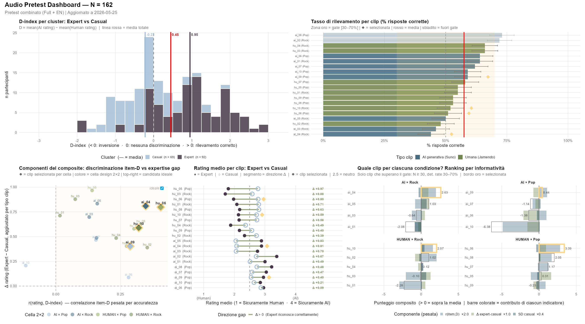

# AI Music Governance CBC Survey

Multilingual Shiny app for a Choice-Based Conjoint (CBC) survey on AI governance in music streaming platforms — master's thesis project, University of Trento. Published on shinyapps.io - [AI_music_governance_cbc_survey](https://parlor.shinyapps.io/AI_music_governance_cbc_survey/)

## Research Question

> In a context where AI-generated content in music DSP catalogues is structurally irreversible, which AI governance regimes are strategically sustainable for industry operators without eroding consumer willingness to pay?

The data from the survey is used to answer the second research sub-question of the thesis: 
> SQ2: Given differentially configured AI content governance regimes — in terms of labelling policy, promotional structure, and user control level — which alternative configurations produce non-negative WTP relative to the reference policies of major streaming operators, and which consumer segments represent addressable markets for differentiated platform strategies?

## Survey Structure

The survey is administered in **Italian, English, and French** and consists of 7 sections:

| Section | Content |
|---|---|
| 1 | Informed consent |
| 2 | GAAIS-10 Short — general attitudes toward AI (Schepman & Rodway, 2025; Italian validation: Cicero et al., 2025) |
| 3 | CBC framing — scenario description and status quo definition |
| 4 | CBC — 12 choice tasks, 3 alternatives, 4 attributes |
| 5 | Audio discrimination task — 4 clips (2 AI-generated, 2 human; randomised order); D-index computed server-side. Placed *after* the CBC to avoid analytic listening priming WTP for restrictive governance |
| 6 | Proxy items (P1–P5 Likert: 3 sonic-discrimination proxy, 2 AI-resistance proxy) + P6 (AI features acceptability checkbox, 6th proxy item, rescaled to Likert 1–5 and combined into the GAAIS_neg-proxy composite) + DSP usage (platform, tier, switching history, churn intent) |
| 7 | Demographics (age, gender, country, role) |

## CBC Design

4 attributes × 3 levels each; **72 valid profiles** out of 81 (1 prohibited pair: A1=L1 + A2=L3; additional constraint: no task may present two alternatives identical on A1, A2, A3 differing only in price). Randomised design generated per-respondent: 3 profiles sampled without replacement from the valid set for each of the 12 tasks.

| Attribute | Level 1 | Level 2 | Level 3 |
|---|---|---|---|
| A1 — AI Labelling | No label (artist self-declaration not required) | Voluntary label (declared by the artist) | Mandatory label (verified by the platform via proprietary algorithm) |
| A2 — AI Promotion | Not included: only via user search | Included in algorithmic recommendations (playlists, radio, similar tracks, automated queues) | Included + dedicated AI section for listening |
| A3 — User Control | None | AI tracks filter: users can exclude AI music from their listening experience | Full filter: tracks filter + disabling of generative AI features (AI DJ, prompted playlists, AI remixes) |
| A4 — Monthly Price | €9.99 | €11.99 (≈ market reference for individual tier) | €13.99 |

Status quo benchmark: A1=L1, A2=L2, A3=L1, €11.99/month.

**A3 dual-filter design rationale**: A3=L2 is a content-only filter (orthogonal to A2 because it acts on individual AI tracks regardless of how the platform surfaces them). A3=L3 adds a second filter that disables the platform's generative AI features (AI DJ, prompted playlists, AI remixes), enabling a direct test of the content-to-tool spillover hypothesis (see H6 below). This avoids the A2×A3 degeneracy that arises when filter levels are defined relative to A2's promotion contexts.

## Segmentation: Sonic-Semantic Acceptance Matrix (SSAM)

Respondents are segmented on two axes via median split:

- **X axis — D-index**: sonic discrimination ability — `mean(AI clip ratings) − mean(human clip ratings)`, D ∈ [−3, 3]. D > 0 indicates discrimination ability; D = 0 no discrimination; D < 0 inverted discrimination.
- **Y axis — GAAIS_neg**: semantic resistance to AI (negative subscale of GAAIS-10, reverse-coded).

This yields 4 quadrants:

| | Low GAAIS_neg (indifferent) | High GAAIS_neg (resistant) |
|---|---|---|
| **Low D (unaware)** | I/I — Unaware Indifferent | I/R — Unaware Resistant |
| **High D (discriminating)** | D/I — Discriminating Indifferent | D/R — Discriminating Resistant |

Proxy operationalisation: 3-item sonic-discrimination proxy (P1–P3, Likert 1–5 → D-index) and 3-item AI-resistance proxy (P4–P5 Likert preference for human curation and active block intent + P6 derived from the AI features acceptability checkbox → GAAIS_neg). The composite allows DSP-observable behavioural segmentation without psychometric instruments (DSP-relevant signals: audio quality preference, repeat listening, filter activations, low engagement with platform AI features).

## Analytical Pipeline
| Phase | Content |
|---|---|
| `Phase 0 — Data preparation & instrument validation` | Data preparation, exclusion of invalid responses, Cronbach α of instruments and convergent validity of proxy variables vs psychometric scales. **Primary SSAM** built on D-index (audio task) and GAAIS_neg (psychometric scale). **Sensitivity-check SSAM** (planned) built on composite latent indicators: X-axis combining D-index + proxy_d (P1–P3) + self_ability via inverse-variance weighting or CFA factor scores; Y-axis combining GAAIS_neg + proxy_gaais_neg (P4–P6). The two SSAMs are compared at the classification level to assess robustness of segment assignments to measurement choice. |
| `Phase 1 — Aggregate Mixed MNL stepwise (H1–H4, H6)` | Stepwise estimation via `apollo`: from fixed MNL, progressive introduction of random parameters and behavioural covariates. WTP estimation. **H1–H4** test directional effects on A1, A2, A3 levels. **H6 (exploratory)**: spillover content→tool, tested as β(A3=L3) − β(A3=L2) > 0 — additional WTP for disabling generative AI features beyond content filtering. |
| `Phase 2 — Structured SSAM heterogeneity (H5a–H5c, H5a'–H5c')` | **Primary (H5a–H5c):** extended MMNL with continuous moderators `gaais_neg_z×A1/A2/A3` and `D_z×A1/A2/A3`, directional Wald tests. **Exploratory (H5a'–H5c'):** median split → 4 SSAM quadrants; individual posterior part-worths from M_final; extended MMNL with interactions `quadrant×A1/A2/A3` (I/I as reference), LRT vs M_final. |
| `Phase 3 — Robustness checks & supplementary analyses` | AI-trust moderation of A2: `A2×gaais_pos_z`, Wald test. Proxy validation: regression `D ~ proxy-D` and `gaais_neg ~ proxy-GAAIS_neg`; re-estimation of M_final with proxy composites. Convergent validity check between proxy_p6 (numeric) and proxy_p6_raw (granular tool selection). |
| `Phase 4 — Policy simulation multi-benchmark` | Configuration × benchmark matrix identifying configurations with non-negative net WTP per operator. Exploratory segment level analysis of configuration-benchmark-pair, including addressability criteria (lift, segment size, lower CI > 0, churn_intent comparison). |
| `Phase 5 — External triangulation: stated vs. revealed` | Correlation individual WTP ↔ `churn_intent` by quadrant. Behavioural triangulation via `switching_past` and `policy_dissatisfaction` share. Optional moderation by `proxy_p6` (rescaled AI-tools acceptance) or by specific tool dummies from `proxy_p6_raw`. |

### Hypothesis H6 (exploratory): content-to-tool spillover

The dual-filter design of A3 (L2 = AI tracks filter only; L3 = tracks + generative AI features filter) enables a direct test of whether resistance to AI content extends to resistance against AI tools:

- **β(A3=L3) − β(A3=L2) > 0** → spillover: users who want to filter AI content *also* want to disable AI tools (resistance generalises across content and tool dimensions)
- **β(A3=L3) − β(A3=L2) ≈ 0** → no spillover: filtering content is sufficient; users do not place additional value on disabling tools
- **β(A3=L3) − β(A3=L2) < 0** → reverse: users value content control but want to keep AI tools active (tools appreciated as instruments, content rejected as creators)

This is conceptually parallel to the convergent validity check between the CBC choices and the P6 checkbox (which captures abstract acceptability of individual AI tools, see Data Collection section).

## Data Collection

Responses are stored in a private Google Sheet (6 tabs):

| Tab | Content |
|---|---|
| `Respondents` | respondent_id, language, timestamps, completion flag |
| `Demography` | audio ratings, D-index, GAAIS items + subscales (pos/neg), proxy items (P1–P6: P1–P5 Likert 1–5, P6 numeric 1–5 rescaled from the AI-tools acceptance count, with `proxy_p6_raw` holding the comma-separated granular selection), churn intent, switching_past, switching_reason, DSP platform, tier (derived from dsp_user), demographics |
| `Survey_Answers` | choice_1 … choice_12 |
| `Choices` | long format — one row per alternative per task (a1_labeling, a2_promotion, a3_control, a4_price) |
| `Funnel` | one row per navigation event — step-by-step dropout tracking (event, detail, timestamp, `duration_sec` = seconds spent in the section that just ended, computed against the previous event for the same respondent) |
| `Partial` | three intermediate snapshots for abandonment recovery: **post-CBC** (GAAIS + CBC choices; audio not yet collected), **post-audio** (+ audio ratings + D-index; proxy empty), **post-proxy** (all except demographics). Analysis rule: `slice_max(ts)` per `respondent_id` |

**DSP usage variables**: `dsp_user` distinguishes paid subscribers (`yes`), free-tier users (`yes_free`), and non-users (`no`). `dsp_tier` (`paid`/`free`) is derived server-side from `dsp_user` — not collected as a separate question. `switching_past`, `switching_reason`, `churn_intent` are collected conditionally on `dsp_user ∈ {yes, yes_free}`.

**Proxy P6 (AI tools acceptability)**: multi-select on hypothetical AI features (AI DJ, prompted playlists, AI remix/cover, in-app AI generator, or none). Stored as two columns: `proxy_p6` (numeric Likert 1–5, rescaled as `5 - count` where count is the number of features accepted excluding `none`; 5 = max resistance, 1 = all 4 tools accepted) and `proxy_p6_raw` (comma-separated string of selected codes for granular descriptive analysis).

## Audio Pretest

Before the main survey, a separate Shiny app was used to select the 4 final audio clips (2 AI-generated, 2 human-made) from 20 candidates: 10 AI-generated from Suno "Best of" Rock and Pop playlists and 10 human-made from the [mtg-jamendo-dataset](https://github.com/MTG/mtg-jamendo-dataset) (2019). Clips were selected to maximise discrimination variance while controlling for genre.

### Data collection

Two apps were deployed: `pretest_app.R` (IT/FR, 20 clips, n=7 convenience sample) and `pretest_app_en.R` (EN, 10 stratified-random clips per participant, UTM-tracked Reddit sample). Ratings were pooled after quality filtering.

### Results

**N = 162** participants total (7 Italian + 155 English via Reddit: r/sunoai, r/aimusic, direct share). After excluding 1 respondent with >50% *don't know* responses and 2 with fewer than 7 clips listened (connectivity drop), **161 valid participants** remained (Expert subsample: n = 92; Casual subsample: n = 69). Sixteen individual ratings with play_count = 0 were also dropped.

**Gate filter** (N ≥ 30, detection rate 30–70%, non-so ≤ 15%): **18/20 clips pass**. Excluded: `ai_02` (72% correct — ceiling) and `ai_08` (73% correct — ceiling).

**Selected clips** (composite score = 2.0 × z[r(item,D)] + 1.0 × z[Δ expert−casual] + 0.4 × z[SD casual]):

| Cell | Clip | Title | Detection rate |
|---|---|---|---|
| AI × Pop | `ai_09` | "addicted" — lane (Suno) | 59% |
| AI × Rock | `ai_04` | "Mr. Nice Guy" — kysohum (Suno) | 44% |
| Human × Pop | `hu_06` | "Only Human" — Dayung (Jamendo) | 51% |
| Human × Rock | `hu_10` | "Microwave" — Major Major (Jamendo) | 52% |

**Sensitivity analysis** (5 weight scenarios): selection is robust in 3/4 cells across all scenarios. Human × Rock changes (hu_10 → hu_03) only under extreme weight inversion (Δ > r), confirming the composite is not sensitive to the exact weight choice for the planned survey clips.

**Self-reported ability vs. actual accuracy**: r = 0.413 — moderate positive correlation; participants who considered themselves more capable were genuinely more accurate, supporting use of the self-ability item as a convergent proxy in the main survey instrument.



### Files

| File | Content |
|---|---|
| `pretest/pretest_app.R` | IT/FR Shiny app — 20-clip full pretest (n = 7) |
| `pretest/pretest_app_en.R` | EN Shiny app — 10-clip short pretest with UTM tracking (n = 155) |
| `pretest/analysis_pretest.R` | Analysis script — gate filter, composite score, sensitivity analysis, dashboard |
| `pretest/clips_metadata.csv` | Full list of 20 candidate clips with source and metadata |
| `pretest/clip_stats_results.csv` | Detection rates and discrimination scores per clip (Italian subsample) |
| `pretest/dashboard.png` | Analysis dashboard (p1–p5: detection rates, D-index, scatter, expert vs. casual, ranking) |
| `pretest/sample_tracks.R` | Reproducible sampling script (set.seed(57)) |
| `pretest/crop_audio.R` | Audio clip trimming script |
| `pretest/jamendo.py` | Script to query and download candidates from Jamendo API |
| `pretest/style.css` | CSS for the pretest Shiny apps |
| `pretest/data/` | Candidate and selected track lists for Jamendo and Suno |

## Repository Structure

```
├── app.R               # Shiny entry point
├── global.R            # Config, CBC design, scoring functions (D-index, GAAIS)
├── server.R            # Server logic
├── ui.R                # UI layout
├── translations.R      # IT / EN / FR text
├── setup_sheets.R      # One-time Google Sheets initialisation
├── www/                # Static assets (CSS, JS, images, audio clips)
└── pretest/            # Clip selection: pretest app, scripts, results
    └── data/           # Candidate and selected track CSVs
```

## Setup

**Credentials (not in repo):**
- `service_account.json` — Google service account key
- `.secrets/` — OAuth token for local development

**First run:**
```r
source("setup_sheets.R")   # creates/verifies the 6 Google Sheets tabs
shiny::runApp()
```

**Deploy to Shinyapps.io:**
```r
rsconnect::deployApp()
```

Audio clips (`www/audio/`) must be provided manually — see `pretest/sample_tracks.R` and `pretest/clips_metadata.csv` for the selection procedure and clip details.

## References

- Schepman, A., & Rodway, P. (2025). *Validation of the Short GAAIS-10.*
- Cicero, L. et al. (2025). *GAAIS: validation in the Italian context.*
- Hensher, D. A., Rose, J. M., & Greene, W. H. (2015). *Applied choice analysis.*
- Bierlaire, M. (2023). *A short introduction to PandasBiogeme.* (apollo R package reference)

---
